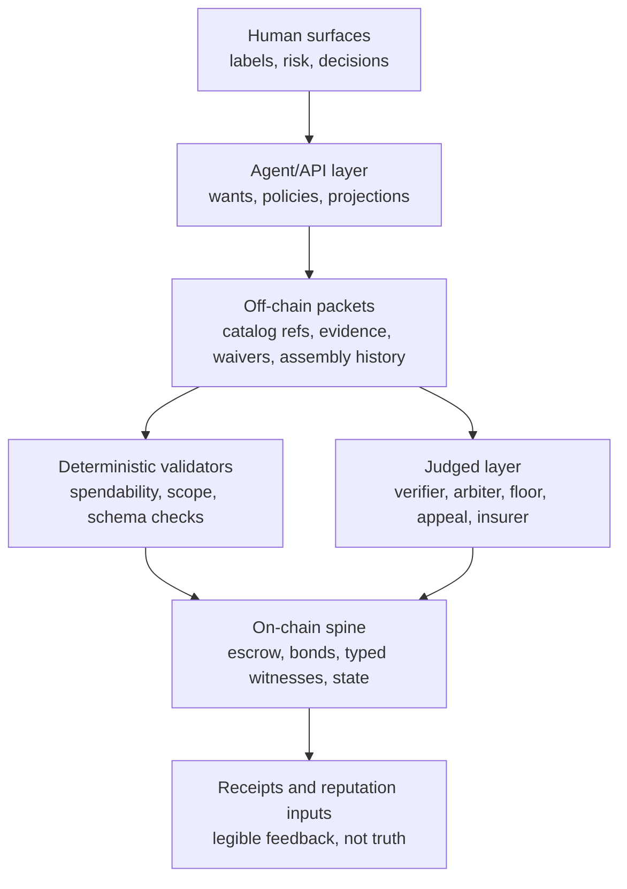

# Cairn Protocol - GPTPRO Review Draft v0.1

Generated: 2026-06-22

Status: alpha review packet. This document is self-contained for a reviewer with no prior thread
context. It consolidates the current Cairn marketplace protocol line, including the latest
judgment-independence and insurance modules, current Solidity implementation evidence, and the
known alpha blockers.

Review request: read this as an adversarial protocol review, not as a pitch. The central discipline is
author != verifier. Find places where a legible or judged claim is accidentally described as enforced,
where sparse evidence is treated as calibration, where an off-chain physical fact is laundered through
a hash/signature/model, or where a value-moving path depends on a gate that is still only prose.

Live-state note:

```text
workspace: /Users/che/Marketplace
branch at drafting: claude/surface-agent
current head observed by subagent: 0d1a9cf (G5 v0.3)
main worktree: /Users/che/marketplace-main
known pre-existing dirty files: Protocol_Arbitration_v0.1.md, mockups/cairn-inventory.html,
mockups/cairn-landing.html, .claude/, and several untracked runs/
```

The dirty files above are not part of this packet except where explicitly named as a shared seam.

## 1. One-page thesis

Cairn is an agent-mediated marketplace protocol for high-trust physical collectibles, starting with
Pokemon single cards. It is not trying to make physical fraud impossible. It is trying to make a trade
accountable by separating what a contract can enforce, what signed evidence can make legible, and what
humans or specialist agents must still judge.

The protocol's core object is not generic "trust." It is access assembly: a trade may proceed only when
the right packet, route, evidence, waiver, bond, and judgment surfaces are placed at the right gate.
Seller history, catalog matches, shop reputation, buyer preferences, photographs, model outputs, and
verifier records can inform a trade, but none of them can move money or authority by themselves.

The project has one law:

```text
No-overclaim: never imply that a contract, hash, image, model, verifier, insurer, or catalog row proves
an off-chain physical truth. It may prove only the mechanical fact it actually checks.
```

What Cairn can enforce today is the on-chain skeleton: escrowed funds, bonds, typed route and delivery
witness acceptance, scope-bound signature acceptance, seller-accepted verifier settlement-route
parameters, floor-route parameters, and liveness/default state transitions. What it cannot enforce is
whether a card is genuine, whether a shop is truly independent, whether a verifier is fair, whether a
package was lost, or whether a human ruling is wise.

The honest alpha posture is:

```text
Low-value and curated cells can run with current enforced surfaces plus explicit value caps.
High-value cells remain outside protocol-mediated alpha routing except as manual curated research cases
with explicit underwriter assumptions and no calibration reliance.
```

The most important lesson from prior adversarial review is the sparse-truth limit: a scoring or
reputation rule that cannot be statistically powered is not calibration. In high-value, low-frequency
cells it becomes certification laundered through a score. Cairn therefore uses two regimes:

- Powered cells: calibration, reputation, and scoring can influence selection.
- Underpowered/high-value cells: underwriting, liability, audit, panel composition, and value caps carry
  the risk.

## 2. Scope and alpha boundary

Initial domain:

```text
domain: tcg
game: pokemon
trade_template: pokemon_single_card_alpha
supported_forms: raw_card | graded_slab
catalog aperture: Pokemon card reference layer, especially Japanese pre-English / No Rarity alpha data
preferred alpha value band: low-to-mid value; high-value grails are outside open alpha
```

Out of alpha unless explicitly marked as future-domain experiments:

- sealed product, lots, bundles, non-Pokemon cards, other collectibles, and general physical goods;
- production insurance, production underwriting, or permissionless high-value routing;
- legal/tax advice for barter, fiat rails, or insurance;
- claims that catalog matching, image recognition, or agent confidence authenticates a card.

## 3. How to read this source set

Naming: this repository historically uses both "Marketplace Protocol" and "Cairn." In this packet,
`Cairn` means the current product/protocol line. Older files may use `Marketplace` for the same project.

Source freshness:

| Source | How to treat it |
|---|---|
| `SYNC.md` | live coordination head; read first for current status |
| `Protocol_Consolidated_Spec_v0.2.md` | current front-door gate map, but predates G5 v0.3 and some chain binds |
| `Protocol_Verifier_v0.4.md` | current verifier design |
| `Protocol_Judgment_Independence_v0.3.md` | current G5 judgment-independence design |
| `Protocol_Insurance_v0.3.md` | current insurance design |
| `Protocol_Agent_API_v0.1.md` | current alpha API vocabulary, but not all endpoints are production-built |
| `Protocol_Human_Surface_v0.2.md` | current surface/no-overclaim guidance |
| `Protocol_Payment_and_Custody_v0.1.md` | product/design source; must be read with the later verifier same-subject conflict correction |
| `Protocol_Arbitration_v0.1.md` | shared seam, not fully reconciled |
| `Marketplace_Protocol_Full_Spec.md` | useful historical/full vocabulary source, but stale as a current-state authority |

Known errata:

- `Marketplace_Protocol_Full_Spec.md` has useful vocabulary and lifecycle context but stale test counts.
- `Protocol_Consolidated_Spec_v0.2.md` reports the then-current 102-test and 5-gate state; current
  chain/drill evidence is 114 Solidity tests and 6 consolidated gates.
- `Protocol_Verifier_v0.4.md` says its route binds are design-only because it predates the later JSC
  chain implementation. The newer chain source is `MarketplaceEscrow.sol` after the JSC route bind
  (`5c5e919`) and floor route bind (`9c0282a`), currently observed at head `0d1a9cf`.
- Versioned older specs are frozen diff targets, not current canon.
- `Protocol_Arbitration_v0.1.md` is current file content but a dirty shared seam, not settled canon.

The current state is therefore not one file. It is the latest module specs plus `SYNC.md`, with this
packet as the review front door.

Current layer diagram:



## 4. Vocabulary

Enforced: checked mechanically by contract or deterministic validator. Examples: signature validity,
role/address distinctness, state transitions, escrow balances, hash equality, typed digest preimages,
replay protection, scope hash equality, bond amounts, and registered membership.

Legible: recorded, signed, typed, measured, or made auditable, but not mechanically settled as true.
Examples: shop relationship labels, common-control disclosures, evidence completeness, reputation
vectors, coverage floors, loss attestations, verifier history, and route-risk placement.

Judged: decided by humans, panels, agents, underwriters, or arbiters. Examples: card authenticity,
condition, whether a ruling is fair, whether a verifier is competent, whether a disclosed conflict is
acceptable, and whether a registry's policy is wise.

Spendability: permission to use a packet or assembly at a named gate. Spendability is not truth. A
route spendability hash can permit route commitment; it does not prove the card is real or successfully
delivered.

Access assembly: the situated collection of references, packets, route commitments, waivers, bonds,
and witnesses that makes an action admissible at one specific gate.

Subject hash: the trade-scoped object identity anchor. It is not an authenticity claim. It gives the
protocol a handle for scope, custody, inventory locks, verifier conflicts, and evidence placement.

Judgment Supply Commitment (JSC): the trade-formation commitment that names the judgment resources the
trade is allowed to use: arbiter/floor, verifier route authority, appeal path, fee shape, evidence
floor, bond/exposure, and witness authority.

Cell: a measurement or policy bucket, such as verifier-by-scope/value-band/card-type/seller-type. A
cell is powered only if enough resolved, provenance-weighted outcomes exist for scoring to mean
anything.

Powered / underpowered: a powered cell can use calibration with positive weight. An underpowered cell
cannot; high-value underpowered cells require underwriting, liability, audit, or value caps.

Value cap: a maximum value, payout, bond relief, or authority ceiling allowed when a gate is immature,
conflicted, underpowered, or downgraded.

Curated: admitted by a bounded, manually governed process rather than an open market.

Underwritten: backed by an explicit liability/capital/audit party, not merely by reputation.

Evidence floor: the minimum evidence shape required for a route, policy, verifier, or judgment path.

Claim matrix: the pre-committed mapping from claim type to evidence, authority, remedy, default, and
appeal path.

Floor / floor executor: the fallback judgment authority for bounded cases where the primary path cannot
resolve. A floor executor can move value only inside the committed route and gate.

Authority ceiling: the maximum action a role can take. Example: a private buyer advisor may advise the
buyer but cannot create seller liability.

Witness settlement ceiling: the exact circumstances, if any, under which a witness packet can settle or
affect a claim.

Wall bundle: the current packet assembly that says which hard requirements, waivers, and escalations
apply at a named gate.

Mutation teeth: a falsification drill property. The clean case admits, the attack blocks, and removing
only the targeted guard makes the attack admit. It shows that the guard is load-bearing in the reference
model.

## 5. Actors

Buyer: states wants, funds escrow, accepts risk waivers, can designate a preferred verifier, and may
open claims with a dispute bond.

Seller: lists or offers the card, accepts escrow terms, posts seller bond, signs route/inventory
commitments, and may accept or counter buyer-designated verifier routes.

Buyer agent / seller agent: reads user preference, policy, reputation, cost, and route data. An agent
may advise and assemble packets. It cannot promote inference into authority.

Verifier: signs scoped evidence claims. A physical verifier claims contact with or inspection of a card
inside a scope. A legibility attestor can attest to metadata or evidence-form checks but does not
physically verify.

Custodian / shop node: holds cards or witnesses handoffs. Local card shops are the seed network, but a
shop that owns, sells, consigns, sources, custodies, or inventory-locks a subject cannot be the neutral
physical verifier for that same subject.

Arbiter / floor executor / appeal panel: judgment authorities that can resolve disputes inside a
pre-committed scope. Their mechanical independence can be checked only to the level of registered
address, role, and conflict data.

Insurer / underwriter: supplies capital for explicit covered predicates. Insurance pays when a trigger
fires; it does not authenticate the card.

Registry operators: maintain actor, verifier, arbiter, eligible-set, coverage-floor, attestation-authority,
control-distance, and trusted-base references. Registry governance is part of the trusted base.

Role/conflict matrix:

| Role | May do | Same-subject / same-trade conflicts |
|---|---|---|
| Buyer | fund escrow, designate advisor/verifier route, open claim | cannot unilaterally give own verifier seller-liability power |
| Seller | offer card, bond, route, accept/counter JSC verifier route | cannot pick the buyer's neutral assurance verifier |
| Custodian/shop | hold card, attest custody, participate as network verifier elsewhere | cannot neutrally physically verify a subject it owns/sells/consigns/custodies/locks |
| Verifier | sign scoped evidence claim | cannot be buyer/seller address; same-subject economic exposure blocks neutral authority where registered |
| Arbiter/floor | rule inside JSC scope | cannot be trade party or overlapping judgment role under G5 where registered |
| Appeal panel | finality path for value-moving judgment | must satisfy G5 and avoid sole-oracle/captured-panel routes at value |
| Insurer | back explicit covered predicate | cannot be trade party; registered/disclosed/low-distance common control cannot buy relief |

## 6. Protocol spine

Cairn splits every action across three layers.

```text
contract / deterministic validator  -> enforced
signed packets / measurements        -> legible
specialist or human decision         -> judged
```

The on-chain decision rule is intentionally narrow:

```text
Bind on-chain only if the rule is mechanical and value-moving.
Hash, sign, label, and measure everything else.
Escalate to judgment when the claim depends on physical reality or semantic fairness.
```

Examples:

| Claim | Correct layer | Why |
|---|---:|---|
| Buyer funded escrow | enforced | contract balance and state |
| Seller posted bond | enforced | value locked in contract |
| Catalog row matches a Pokemon print | legible | row exists; not seller-card proof |
| Card is authentic | judged | physical/semantic fact |
| Verifier signed scope X | enforced | signature and scope hash |
| Verifier is fair | judged | cannot be proven by address/signature |
| Shop disclosed custody relation | legible/enforced where registered | disclosure can be anchored; truth can be hidden |
| Insurance trigger packet accepted | enforced only as to active, unpaid, in-window, scope-matched authorized trigger form | trigger acceptance is not proof of loss or covered-event truth |
| Buyer-designated verifier is neutral | false / forbidden | route is buyer-designated, not neutral |

## 7. Current implemented surface

Current Solidity lives under `chain/` and is written for Solidity `^0.8.24`.

Contracts:

- `MarketplaceActorRegistry.sol`: actor/verifier/arbiter/predicate-verifier registration,
  revocation, active-role checks, and signature recovery.
- `MarketplaceInventory.sol`: item registration, ownership transfer, custody assignment,
  custody attestation, item lock/unlock, anti-self-custody attestation.
- `MarketplaceEscrow.sol`: escrow funding, seller bond, proof/evidence anchoring, item
  fingerprint, inventory lock, route and delivery spendability witnesses, claims, arbitration,
  JSC verifier routes, floor judgment routes, and settlement.
- `MarketplacePredicateVerifierStub.sol`: a registered verifier-contract stub for predicate-gated
  evidence. It is not a production ZK verifier.

Fresh verification run for this packet:

```text
cd /Users/che/Marketplace/chain
/Users/che/.foundry/bin/forge test
result: 114/114 passing
  MarketplaceEscrowTest: 102/102
  MarketplaceInventoryTest: 12/12
```

Important implemented mechanics:

- Actor registry blocks unregistered or revoked buyers, sellers, arbiters, verifiers, and verifier
  contracts from the relevant paths.
- Escrow state machine controls funding, seller bond, route lock, inspection, claim, resolution, and
  settlement.
- Seller cannot mutate a committed route after commitment.
- Route commitment requires wall bundle, assembly history, route spendability, inventory lock, and a
  typed route assembly witness.
- Delivery requires delivery spendability and typed delivery witness before inspection opens.
- Spendability hashes are trade-bound, gate-bound, and consumed to prevent replay.
- Item fingerprint and inventory lock prevent active double-use across trades.
- Verifier attestations require approved scope and anchored subject.
- JSC verifier settlement routes now have an on-chain binding: seller-accepted route hash, accepted
  verifier, scope, evidence floor, fee shape, buyer dispute bond requirement, verifier bond/exposure/tail,
  appeal hash, and witness settlement ceiling.
- Buyer-designated private-advisor routes cannot create seller liability; settlement-verifier routes
  need seller acceptance and a locked verifier bond.
- Post-delivery unresolvable claims no longer fall through to a plain buyer-favoring default. The
  post-delivery branch requires a floor receipt signed by the trade's floor executor.
- Floor judgment routes bind the floor executor to a non-party, non-sole route core: floor route,
  panel members, `requiredSignatures >= 2`, panel signatures over exact ruling/receipt hash, and an
  appeal-window stay.
- The current chain binds a floor-signed receipt gate; until return/custody constraints, claim-type
  constraints, and full appeal finality are also bound, this branch must remain value-capped/manual.

Important not implemented or not fully implemented:

- Production payment rail, on-ramp, stablecoin deployment, and admin-key policy.
- Production predicate/ZK verifier. The current predicate verifier is a stub.
- Full control-distance, disclosure, `JudgmentEligibleSet`, coverage-floor, attestation-authority,
  insurance reserve, and liability-anchor registries.
- Tier-scaled high-value G5 panel sizes, registered pairwise/common-control checks, and G5.9 structured
  liability anchors on-chain.
- Full appeal finality state machine beyond the current floor appeal-window stay.
- Production insurance policy instruments and payout execution.
- Production verifier router and reputation estimators.
- Production human UI surfaces and agent runtime.

## 8. Lifecycle

The protocol lifecycle can be read as fourteen gates:

1. Intent: buyer and agent express a want, budget, evidence floor, route preferences, and risk posture.
2. Catalog reference: the agent anchors the requested print to a catalog row. This is a reference only.
3. Discovery/proposal: seller offers a specific card with evidence and terms.
4. Trade formation: parties agree price, rail, bond, JSC, verifier route class, route expectations, and
   claim matrix.
5. Funding: buyer funds escrow; seller can cancel before bond under signed conditions.
6. Seller bond: seller accepts terms and posts bond. If a JSC verifier route is present, seller must
   accept the exact route hash.
7. Item fingerprint: the specific subject is anchored for this trade.
8. Inventory lock: seller availability is locked to prevent double-sale or route ambiguity.
9. Evidence and verifier scope: proofs, evidence packets, scope-bound signature packets, and verifier
   approvals are attached under exact hashes.
10. Route commitment: seller commits route, wall bundle, assembly history, route spendability, and typed
    route witness.
11. Delivery/inspection: delivery witness and spendability open the inspection window.
12. Acceptance or claim: buyer accepts, lets inspection auto-settle, opens an inspection claim, or opens
    a route/non-delivery claim after timeout.
13. Resolution: arbiter, accepted verifier settlement route, floor route, or default branch resolves
    inside the committed authority ceiling. Registry/eligible-set snapshots must precede judgment
    assignment; G2 capacity/downgrade must be known before route commitment; buyer-favoring
    post-delivery outcomes need return/custody or floor-receipt constraints.
14. Settlement/final receipt: escrow and bonds move according to the resolved branch only after the
    applicable appeal bond/finality/stay conditions. Receipts preserve what was enforced, legible, and
    judged, and bond tails remain until their release condition.

Value-tier posture:

| Tier | Typical posture | Required shape |
|---|---|---|
| Low value | curated alpha can run if current gates hold | escrow, bond, route/delivery witnesses, claim matrix, value caps |
| Mid value | gated alpha | stronger evidence floor, verifier route, dispute bond, floor receipt/default limits |
| High value | not admitted to open alpha | manual/bespoke only until G5, registry, insurance, reserve, and appeal-finality schemas are bound |
| Grail / exceptional | manual or heavily underwritten | bespoke custody, N-of-M, return-custody paths, explicit underwriter, no open calibration reliance |

## 9. Access assembly and packet boundaries

Cairn refuses to let strong-looking context spend by itself.

Separated access variables include:

- `CardReferenceCandidate`: catalog anchor, not possession/authenticity.
- `item_fingerprint_hash`: object-contact anchor for this trade.
- `inventory_lock_hash`: seller availability and anti-double-sell placement.
- `proof_vector_scope_packet`: what evidence is allowed to claim.
- `bond_scope_packet`: which failures a bond can cover.
- `route_insurance_risk_owner_packet`: who owns route loss or gap risk.
- `arbiter_policy_hash`: dispute closure matrix.
- `BuyerRiskAcceptance`: explicit waiver placement, not verification.
- `wall_bundle_hash`: current wall packet assembly.
- `assembly_history_hash`: provenance graph tying route authority to source packets.
- `route_spendability_hash`: permission to spend the assembled route at route commitment.
- `routeAssemblyWitnessHash`: typed on-chain witness for route commitment.
- `delivery_spendability_hash` and `deliveryWitnessHash`: analogous delivery gate packets.

Terminal floor over access variables:

```text
pass             = required placement exists for this gate
block            = a hard placement variable is absent
waiver_required  = route can proceed only with explicit risk placement
escalate         = scoped judgment is required
```

The EVM witness can show that a correctly typed route or delivery commitment was supplied. It does not
show that the card is genuine, correctly graded, fairly priced, or safely delivered.

## 10. Catalog and reference substrate

The catalog substrate gives agents stable references for known card prints. It does not prove a seller
has the card, that the card is authentic, that it is in the claimed condition, or that the price is fair.

Maturity: catalog references and local catalog tooling exist as legibility/reference surfaces. Catalog
build freshness, source coverage, and policy hashes must be cited per packet. They are not on-chain
truth and do not authenticate the object.

Current alpha reference shape:

- `CardReferenceCandidate` points to a catalog row, source id, catalog hash, row hash, policy hash, and
  `not_claiming` list.
- Catalog lineage and policy hashes are legibility anchors. They can define evidence defaults and
  reference identity for the print, not physical object truth.
- The Japanese pre-English / No Rarity catalog aperture is useful because the domain has scarce,
  high-context variants where catalog mistakes can become trade mistakes. The protocol response is
  citation, policy, and `not_claiming` boundaries, not automatic certainty.

Hard rule:

```text
catalog_hash + row_id anchors a catalog row.
It does not prove possession, condition, authenticity, seller inventory, seller language, route success,
seller trust, or price truth.
```

## 11. Verifier market

Verifier design is currently specified in `Protocol_Verifier_v0.4.md`.

The corrected verifier law:

```text
Cross-verification is the default design route for seeking neutral placement.
Buyer-designated verification is allowed, but it carries relationship labels and only gains settlement
power by mutual pre-commitment.
```

Verifier facts:

- A verifier signs a scoped claim, never a verdict.
- High-value verifier quality cannot rest on open-market calibration unless the cell is powered.
- A local card shop can be a trusted verifier for the buyer, but if it has same-subject custody,
  ownership, consignment, sourcing, sale, or inventory-lock exposure, it cannot be the neutral physical
  verifier for that subject.
- Neutral-routing design targets use cross-verification, committed eligible sets, blind/non-party
  assignment, flat buyer/escrow-paid fees, and pair caps. This targets neutral placement; it is not
  proof of semantic independence.
- Buyer-designated routes are first-class but authority-labeled:
  - private advisor: buyer-side advice only, no seller liability;
  - settlement verifier: power only if seller pre-accepts exact scope, fee, evidence floor, and appeal path;
  - dispute witness: evidence input, not settlement-final unless the arbitration ladder grants authority.
- Seller agents need bilateral legibility: false passes, false rejects, upheld/overturned rate, evidence
  completeness, peer-relative harshness, pairing concentration, withdrawal/correction rates, and
  underpowered-cell labels.

Runnable verifier drills:

```text
python3 simulations/shop_verifier_conflict_drill.py
result: 8/8 with mutation teeth

python3 simulations/buyer_designated_route_drill.py
result: 7/7 with mutation teeth
```

Maturity:

- The chain has subject hashes, scope hashes, buyer approvals, signatures, and a first JSC settlement
  route binding.
- The full verifier router, fee-shape enforcement beyond JSC surfaces, custody-conflict registry,
  reputation-vector estimators, audit economics, and powered-cell math are not production-built.

## 12. Judgment independence (G5)

Judgment-independence design is currently specified in `Protocol_Judgment_Independence_v0.3.md`.

G5 exists because a captured authority can rubber-stamp the whole machine. It applies to verifiers,
arbiters, floor executors, and appeal panels.

Bright line:

```text
Passed G5 does not mean fair judge.
It means no known mechanical/registered conflict under the available gate.
Semantic or undisclosed common control remains legible/judged and value-capped.
```

G5 gates:

- G5.1 non-party authority.
- G5.2 role exclusivity.
- G5.3 registered control-distance, with undisclosed never admitted as clean and disclosed-low only as
  a value-capped downgrade.
- G5.4 non-sole-oracle and bound panel: N-of-M at value, M-distinct members, each member has its own G5
  ref, enough signatures, and no registered pairwise/common-control conflict.
- G5.5 appeal finality, not just a stay: appeal window, independent appeal authority, execution stay,
  final appeal state, appeal bond, and bounded stay.
- G5.6 pairing/rotation cap.
- G5.7 structured disclosure.
- G5.8 downgrade ladder for liveness when required independence is unavailable.
- G5.9 sparse-truth anchor: exposure, capital >= exposure, tail, audit, slash, registered provider
  conflict treatment, and no calibration weight in underpowered cells.
- G5.10 `JudgmentEligibleSet`: committed root, non-party seeded selection, member G5 refs,
  party-independent governance, registered version.

Maturity: verifier route authority is partially chain-bound through the later JSC settlement-route
implementation. The neutral router, reputation estimators, custody-conflict/control registries, and
fairness judgments remain specified or judged, not fully built.

Current chain status:

- Bound on floor path: G5.1, a G5.4 core with `requiredSignatures >= 2`, and G5.5 appeal-window stay.
- Not yet fully bound: tier-scaled M, `JudgmentEligibleSet`, registered pairwise/common-control refs,
  structured G5.9 liability anchors, and full appeal finality state machine.

Runnable G5 drill:

```text
python3 simulations/judgment_independence_drill.py
result: 10/10 gates, 33/33 subguards with independent teeth
```

## 13. Arbitration and floor

Arbitration is the judged closure layer. It should be read through the JSC and G5 modules because
`Protocol_Arbitration_v0.1.md` is a shared seam with known edits and should not be treated as fully
reconciled.

Core arbitration requirements:

- Scope competence: each authority only rules on the claim types and evidence classes it was admitted
  to judge.
- Reproducibility: rulings carry hashes and reasons sufficient for later audit.
- Evidence symmetry: both buyer and seller evidence must be representable and contestable.
- Appeal and floor routes must not let liveness become safety.
- A timeout default can move value only under claim-type-specific conditions or with the appropriate
  floor/unresolvable receipt and custody/return constraints.

Current chain status:

- Route/non-delivery default remains available after timeout.
- Post-delivery buyer-favoring default requires a floor-signed unresolvable-claim receipt.
- Floor and verifier settlement routes have mechanical route bindings, but richer appeal execution and
  liability/slash math are not fully built.
- The current chain binds a floor-signed receipt gate; until return/custody constraints, claim-type
  constraints, and full appeal finality are also bound, this branch must remain value-capped/manual.

## 14. Insurance

Insurance is specified in `Protocol_Insurance_v0.3.md`.

Insurance is the intended accounting bucket for explicitly covered residual risk, not evidence that
risk is correctly priced or removed:

```text
If a covered event is ruled or attested under the agreed trigger, the policy pays.
The policy does not authenticate the card and does not prove the loss happened.
```

Insurance gates include:

- trigger is ruling, on-chain mechanical state, or authorized attestation, never insurer discretion;
- insurer is not the trade party address;
- reserve and aggregate exposure caps;
- post-delivery buyer-favoring payout where the buyer still holds the card requires return custody;
- premium or coverage is not displayed as an authenticity, route-safety, verifier-quality, or low-risk
  verdict;
- bond relief is non-additive and solvency-gated;
- subrogation is bounded by actual payout;
- deductible >= floor;
- reserve integrity: unique reserve ref, non-rehypothecation, stack conservation, declared asset, haircut;
- coverage floor registry: predicate bits, exclusion bits, window bounds, payout formula, registered ref;
- registered/disclosed/low-distance common control barred from buying relief; undisclosed common control
  is value-capped and signal-discounted, not claimed impossible;
- high-value insurance requires a G5-qualified, non-sole floor path or value cap;
- payout requires active, unpaid, authorized, final, unstayed, in-window, scope-matched trigger;
- attested trigger requires authorized signer, scope match, enum outcome, and anchored attestation.

Runnable insurance drill:

```text
python3 simulations/insurance_gates_drill.py
result: 15/15 gates, 35/35 subguards with independent teeth
```

Maturity:

- Insurance is design-only in the chain. There is a declared-insurance field on route commitment, but
  no production policy instrument, reserve registry, attestation-authority registry, or payout execution.
- High-value insurance depends on G5 floor independence and the coverage-floor/attested-trigger schemas.

## 15. Payment and custody

Payment principle:

```text
Pay how the user wants; enforce with programmable escrow where protection matters.
```

Maturity: payment and custody are product/protocol design surfaces. The chain enforces escrowed digital
funds for the implemented path, but production on-ramp, stablecoin administration, merchant-of-record,
shop onboarding, insurance layering, and atomic swap choreography are not fully built.

Rail trichotomy:

- stablecoin/on-chain: enforced escrow, release, slash, and non-custodial contract holding;
- fiat/card on-ramped to stablecoin: fiat feel, programmable escrow underneath, but on-ramp/KYC/chargeback
  trust remains;
- off-chain fiat/cash/Zelle: recorded but not escrowed;
- barter/handshake: judged human settlement unless wrapped in protocol escrow/swap.

Custody principle:

```text
Distributed, bonded, reputation-backed shop custody instead of one central vault.
```

Important caveat: the older payment/custody doc says shop nodes do custody and verification. The current
verifier design refines this: a shop network can supply custody, verification capacity, and locality,
but the same shop cannot neutrally verify the same subject it currently owns, sells, consigns,
custodies, or inventory-locks. Cross-verification is the primitive. A local buyer-trusted shop can be
a buyer-designated verifier, but it must be labeled and authority-capped unless the seller accepts it
under JSC terms.

Atomic swap:

- native card-for-card plus optional cash delta;
- protocol can prevent one side from running off with both assets inside the supported escrow route;
- swap does not authenticate either card.

## 16. Agent and API layer

Cairn is agent-mediated. The agent layer should make ambiguity more precise, not hide it.

Current API design includes:

- catalog lookup and `CardReferenceCandidate`;
- buyer want packets;
- seller attention fee terms;
- settlement rail terms;
- seller bootstrap terms;
- external trust import;
- cost-dimensional integrity;
- human availability windows;
- memory currencies;
- legibility vectors;
- actions such as evaluate offer, request evidence, quote/accept evidence request fee, accept offer and
  fund escrow, seller route commit, mark delivered, open claim, and resolve claim.

Maturity: this is an alpha API/spec surface plus local validators and drills. It is not a production
agent runtime.

Agent law:

```text
The model may interpret human desire.
The model may not mint authority.
The model may not spend from inference.
Every value-moving projection must cite an active, in-scope, mandate-authorized claim.
```

Runnable principal-profile evidence:

```text
python3 simulations/principal_profile_drill.py
result: 8/8

python3 simulations/projection_validator.py
result: 14/14
```

This shows the reference deterministic authority lattice and projection validator block the encoded
authority leaks. It does not show that a live LLM chooses good questions, reads evidence well, or
behaves robustly.

## 17. Human surface

The human surface must preserve the same trichotomy:

- show enforced facts as mechanical;
- show legible evidence as evidence;
- show judged calls as judgments;
- never use UI copy that implies a catalog match, image similarity, verifier signature, or policy premium
  proves authenticity.

Forbidden surface moves:

- "verified authentic" as a protocol fact. If an authority made that call, render it as:
  "Authenticity judgment: [authority] judged [outcome] under scope [scope], appeal/finality [state]";
- "insured, therefore safe";
- "catalog matched, therefore real";
- "neutral verifier" for a buyer-designated route;
- "conflict-free" when the actual claim is only "no registered same-subject conflict";
- "escrowed" for off-chain fiat that the contract does not hold.

Maturity: design/spec surface, not production UI.

The intended user experience is not a wall of caveats. It is a compact decision surface that lets an
agent or collector see: what is enforced, what is legible, what remains judged, what it costs to reduce,
route, or price the gap, and what value cap applies if the gap remains open.

## 18. Alpha admission gates

Current consolidated gates:

| Gate | Requirement | Current status |
|---|---|---|
| G1 liveness default | post-delivery buyer-favoring timeout default needs return/custody evidence, floor unresolvable receipt, or claim-type-specific remedy | partially chain-bound through floor receipt branch; value-capped/manual until return/custody, claim-type, and appeal-finality constraints are also bound |
| G2 custody/verifier capacity | same-subject custodian cannot be neutral physical verifier; route must downgrade if no capacity | design/routing gate, not fully built |
| G3 JSC verifier settlement | buyer-designated settlement power needs named JSC schema and seller acceptance | first chain binding implemented |
| G4 bond relief non-additive | import/bootstrap/coverage relief cannot stack onto the same bond | spec/drill, not full production policy |
| G5 self-arbitration/judgment independence | no party address, prohibited role overlap, or registered control-distance conflict at the mechanical level; semantic capture remains judged and value-capped | floor core chain-bound; v0.3 high-value schemas design-only |
| G6 catalog match never authentication | catalog reference cannot render as authenticity | surface/API invariant |

Runnable consolidated gate drill:

```text
python3 simulations/consolidated_alpha_gates_drill.py
result: 6/6 gates with mutation teeth
```

## 19. Trusted base

Cairn reduces some trusted middleman power but does not become trustless.

Trusted dependencies:

- deployed contract code and admin keys;
- actor/verifier/arbiter/predicate-verifier registries;
- stablecoin issuer and freeze/blacklist/depeg behavior;
- fiat on-ramp, KYC, merchant-of-record, and chargeback handling;
- catalog source and build pipeline;
- off-chain validator stack and versioning;
- verifier/custody/judgment eligible-set registries;
- coverage-floor and attestation-authority registries;
- router randomness and seed source;
- registry governance, update delay, versioning, override path, and denied-candidate logs;
- underwriter, insurer, and liability-anchor capital;
- LLM runtime and prompt/config for agent surfaces;
- oracle/signers for any score roots or external facts.

The trusted-base manifest is not optional. A reviewer should ask whether each dependency is named, what
it can corrupt, whether it is party-independent where necessary, and whether a value cap applies if it
is not.

## 20. Attack surface to review

Push hardest here.

1. Sparse truth and calibration laundering. Are high-value/low-frequency cells still being described as
   calibrated when they cannot be powered?
2. Physical-truth laundering. Does any hash, signature, image, model, catalog row, insurance trigger, or
   verifier packet accidentally read as proof of authenticity, condition, custody truth, or loss truth?
3. Assignment capture. Can a seller, buyer, platform, shop cartel, or registry operator shape eligible
   sets, panel selection, verifier routes, seeds, or downgrade paths?
4. Buyer-designated verifier capture. Can "route it through my verifier" become settlement leverage
   without seller acceptance, dispute bond, neutral appeal, and bilateral reputation?
5. Shop-network deadlock. At seed scale, can the protocol actually supply non-custodian verification, or
   does it silently fall back to conflicted custody verification?
6. Common-control residual. Are address distinctness and registered conflicts being over-described as
   semantic independence?
7. Liveness as safety. Do timeout defaults, appeal stays, arbiter revocation, or floor liveness paths move
   value without enough custody/return/finality constraints?
8. Insurance premium laundering. Can a narrow or common-controlled policy produce a cheap premium that
   looks like a trust signal while never paying?
9. Reserve and capital integrity. Does "fully reserved" hide asset volatility, custodian risk,
   double-counted reinsurance, or capital costs that make the market adverse-select?
10. Censored denominators. Are reputation vectors reading only appealed/resolved cases while ignoring
    withdrawals, declines, off-protocol settlements, non-appeals, and silent false rejects?
11. Appeal-stay griefing. Can a frivolous appeal or stalled appeal authority lock funds indefinitely?
12. Surface boundary leak. Would a normal buyer or seller leave the UI believing the protocol proved more
    than it did?

## 21. Maturity ledger

Built and tested:

- core escrow/inventory/registry Solidity surfaces listed in section 7;
- typed route and delivery spendability witnesses;
- subject/scope-bound verifier attestations;
- JSC verifier settlement route first binding;
- floor judgment route first binding;
- post-delivery floor-receipt branch;
- deterministic falsification drills listed above.

Relevant current run reports:

- `runs/local_evm_protocol_20260612T165645Z/REPORT.md`: local EVM scenario families and residuals.
- `runs/wall_bundle_route_spendability_drill_20260612T165705Z/REPORT.md`: wall bundle / assembly /
  route spendability path.
- `runs/spendability_gate_bypass_drill_20260612T165705Z/REPORT.md`: old no-spendability route ABI
  fails closed.
- `runs/protocol_gap_negative_drill_20260612T180021Z/REPORT.md`: physical gaps remain open even when
  protocol gates pass.

Specified with drills, not fully chain-built:

- consolidated G2/G4/G6 production gates;
- G5 v0.3 high-value schemas;
- verifier neutral router and buyer-designated route policy;
- insurance I1-I15 policy schemas;
- principal-profile authority lattice and projection validator.

Design-only or under-specified:

- production payment/on-ramp and stablecoin admin policy;
- production insurance contracts and reserve custody;
- control-distance, disclosure, eligible-set, coverage-floor, attestation-authority, and liability-anchor
  registries;
- powered-cell effective-N thresholds, confidence intervals, censoring weights, audit rates, slash
  sizes, bond sizing, value caps, tier-scaled M-of-N sizes, appeal bond sizing, bounded-stay lengths;
- production agent runtime and UI.

Known dirty/shared seam:

- `Protocol_Arbitration_v0.1.md` is a shared seam with unresolved edits. Treat arbitration concepts here
  as current through JSC/G5/G1 bindings, not as a fully reconciled standalone arbitration spec.

## 22. Evidence commands

Commands run for this review packet:

```bash
cd /Users/che/Marketplace/chain
/Users/che/.foundry/bin/forge test
# 114/114 passing

cd /Users/che/Marketplace
python3 simulations/consolidated_alpha_gates_drill.py
# 6/6 gates with teeth

python3 simulations/judgment_independence_drill.py
# 10/10 gates, 33/33 subguards

python3 simulations/insurance_gates_drill.py
# 15/15 gates, 35/35 subguards

python3 simulations/shop_verifier_conflict_drill.py
# 8/8 cases with teeth

python3 simulations/buyer_designated_route_drill.py
# 7/7 cases with teeth

python3 simulations/projection_validator.py
# 14/14 projection validator cases

python3 simulations/principal_profile_drill.py
# 8/8 principal-profile authority cases
```

These drills provide evidence that the reference gates reject the encoded attack cases and that mutation
controls exercise those cases. They do not show that the attack list is complete, that production
integration preserves the same checks, that registries will be governed correctly, or that a production
LLM/user interface will preserve the boundaries.

## 23. Review questions for GPTPRO

Please answer in a findings ledger with severity and fix shape.

1. Is the enforced/legible/judged spine internally consistent, or does any section still put a semantic
   off-chain fact in the enforced bucket?
2. Does the access-assembly model actually prevent trajectory/reputation/catalog/model outputs from
   spending by themselves?
3. Are the current G1/G3/G5 chain bindings enough for low-value curated alpha, or is there still a
   value-fatal branch?
4. Does G5 v0.3 close the v0.2 schema gaps, or do `JudgmentEligibleSet`, G5.9 anchors, or G5.5 appeal
   finality still need additional fields before high-value use?
5. Is the buyer-designated verifier model symmetric enough, or can it still be weaponized against
   sellers despite seller acceptance, dispute bond, bilateral reputation, and neutral appeal?
6. Is insurance correctly framed as trigger-based residual-risk coverage, or does the premium/coverage
   language still become an authenticity signal?
7. Does the trusted-base manifest name every dependency that can corrupt an enforced or legible claim?
8. Where should value caps sit before G2 capacity, registries, insurance, and appeal-finality are built?
9. What is the strongest 13th attack not listed in section 20?
10. What must be deleted or rewritten before this document is appropriate to show to a non-technical
    collector without boundary leaks?
11. Which source-drift note or erratum is still ambiguous?
12. Is the lifecycle complete enough to find every value-moving transition?
13. Which module still lacks a local maturity label?
14. Which evidence commands should GPTPRO rerun before trusting the packet?
15. What measurable admission test should G2 shop-network capacity use?

## 24. Current verdict from the authors

The protocol survives as an alpha architecture, not as a finished production system.

No current reviewed module has found a thesis-fatal contradiction after the major corrections:

- calibration is regime-gated, not universal;
- high value is curated/underwritten, not an open calibration market;
- buyer-designated verification is first-class but authority-labeled;
- insurance pays trigger events, not truth;
- judgment independence is necessary, not sufficient;
- semantic independence and physical truth stay out of the enforced bucket.

The remaining blockers are concrete:

- build or value-cap the custody/verifier capacity gate;
- bind or value-cap the G5 v0.3 registries and appeal finality state machine;
- bind or value-cap insurance registries/reserves/attested triggers;
- complete the standalone Verifier v0.4 review;
- reconcile the Arbitration shared seam;
- keep every user-facing surface from laundering legible/judged claims into enforced certainty.

That is the honest shape: Cairn is a disciplined accountable-market protocol in alpha. It is not yet a
permissionless high-value marketplace, and the document should be reviewed with that ceiling in mind.
